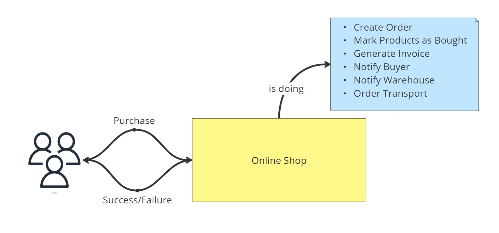
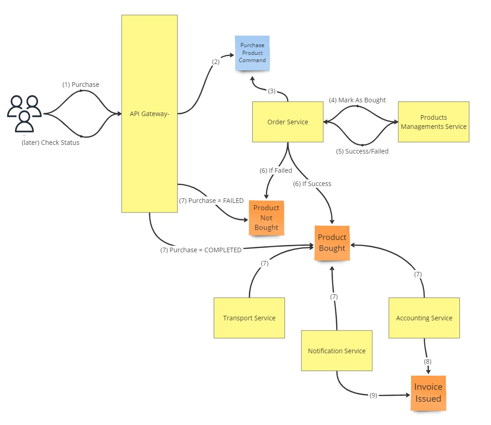

# Monolith vs Microservices
Intro to present differences between two architectures. Both implementations cover the same [requirements](#requirements).
1. [With Monolith Architecture](#monolith)
2. [With Microservices Architecture](#microservices)

### Requirements
- Create order
- Mark products as bought
- Create invoice
- Send invoice to buyer
- Notify warehouse 
- Order transport
- Expose API to list all:
  - products
  - orders
  - invoices
  - notifications
  - transport orders

# Monolith
### Modules
- [monolith](./monolith)

### How to run in IDE
1. Open `OnlineShopApp` from [monolith](./monolith) module.
2. Run the class.

### REST endpoints
1. GET: `http://localhost:8080/invoice` - list of all invoices.
2. GET: `http://localhost:8080/transport-order` - list of all transport orders.
3. GET: `http://localhost:8080/notification` - list of all notifications.
4. POST: `http://localhost:8080/purchase` - allows to purchase products. Accepted JSON e.g.:
```json
{
    "buyerId": 13,
    "products": [4, 5],
    "street": "Grodzka 13",
    "postalCode": "01-234",
    "city": "Cracow"
}
```
5. GET: `http://localhost:8080/order` - list of all notifications.
6. GET: `http://localhost:8080/order/{orderId}` - details of the order where `{orderId}` is an identifier of the order.
7. GET: `http://localhost:8080/product` - list of all products.

### Design


# Microservices
### Modules
#### Services
- [accounting-service](./accounting-service)
- [api-gateway](./api-gateway)
- [notification-service](./notification-service)
- [order-service](./order-service)
- [products-management-service](./products-management-service)
- [transport-service](./transport-service)

#### Infrastructure 
- [schemas](./schemas) - Repository with Commands and Events schemas.
- [docker-compose.yml](docker-compose.yml) - kafka cluster with all required topics created.

### How to run in IDE
1. Start Docker.
2. Execute [docker-compose.yml](docker-compose.yml) to start kafka cluster.
3. Open each `*App` classes from [services](#services) paragraph and run them.

### REST endpoints
1. GET: `http://localhost:9001/invoice` - list of all invoices.
2. GET: `http://localhost:9001/transport-order` - list of all transport orders.
3. GET: `http://localhost:9001/notification` - list of all notifications.
4. POST: `http://localhost:9001/purchase` - allows to purchase products. Accepted JSON e.g.:
```json
{
    "buyerId": 13,
    "products": [4, 5],
    "street": "Grodzka 13",
    "postalCode": "01-234",
    "city": "Cracow"
}
```
5. GET: `http://localhost:9001/order` - list of all notifications.
6. GET: `http://localhost:9001/order/{orderId}` - details of the order where `{orderId}` is an identifier of the order.
7. GET: `http://localhost:9001/product` - list of all products.
8. GET: `http://localhost:9001/purchase` - list of all purchases.
9. GET: `http://localhost:9001/purchase/{purchaseId}` - details of the purchase where `{purchaseId}` is an identifier of the purchase.

### Design



# Monolith vs. Microservice
### Monolith
* Everything works or everything does not work
* More code in one repository
* More knowledge required to start
* Solutions from different areas are in one place

### Microservices
* Some services can be down and system can still work
* Complex infrastructure
* Risk of introducing Distributed Monolith
* Additional API gateway as an entry point to the platform
* Logging, tracing and monitoring is challenging
* Easier to scale the part

### That's not all folks...
* Security
* Retry, Circuit Breaker, Cache
* Service Registry
* Configuration Service
* Distributed Transactions, Eventual Consistency, Outbox Pattern
